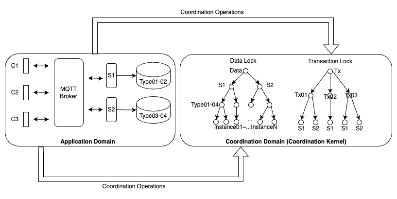
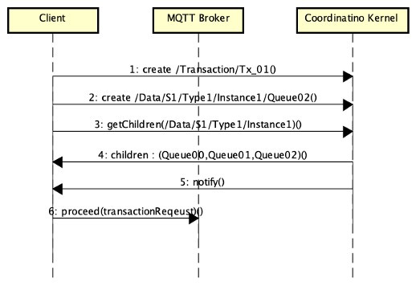

# Distributed-Queued-Transaction
It's my Master's Thesis in Coputer Seceince about the design and implementation of an **optimized Two Phase Commit transcation system (2PC)**.
## Design Description
Message translation uses the **MQTT** protocol to **solve the request staving issue**, improving system efficiency and network resource utilization. **Apache Zookeeper** is used to design the distributed lock mechanism, implementing the message acknowledgment process in **2PC**, as well as the mechanism for queueing database access in different isolation levels. 

 ### Two Phase Commit

---
 ### Isolation Level
According to the ANSI SQL standard, the isolation levels can be classified into the following four types:

 **1. Read Uncommitted :**
 * When a transaction is currently reading a data field, other transactions can read and write to that field.
 * When a transaction is currently writing to a data field, other transactions can read the field but cannot write to it.
 > 當目前的資料欄位有交易正在讀取時，其他的交易可以對該欄位進行讀取、更新。  
 > 目前的資料欄位有交易正在更新時，其他的交易可以對該欄位進行讀取，但無法進行更新。
 
 **2. Read Committed**
 * When a transaction is currently reading a data field, other transactions can read and write to that field.
 * When a transaction is currently writing to a data field, other transactions cannot read or write to that field.
 > 當目前的資料欄位有交易正在讀取時，其他的交易可以對該欄位進行讀取、更新。 
 > 目前的資料欄位有交易正在更新時，其他的交易無法對該欄位進行讀取、更新。
 
 **3. Repeatable Read**
 * When a transaction is currently reading a data field, other transactions can read the field but cannot write to it.
 * When a transaction is currently writing to a data field, other transactions cannot read or write to that field.
 > 當目前的資料欄位有交易正在讀取時，其他的交易可以對該欄位進行讀取，但無法進行更新。 
 > 目前的資料欄位有交易正在更新時，其他的交易無法對該欄位進行讀取、更新。
 
 **4. Serializable**
 * When a transaction is currently reading a data field, other transactions cannot read or write to that field.
 * When a transaction is currently writing to a data field, other transactions cannot read or write to that field.
 > 當目前的資料欄位有交易正在讀取時，其他的交易無法對該欄位進行讀取、更新。 
 > 目前的資料欄位有交易正在更新時，其他的交易無法對該欄位進行讀取、更新。

## Awards and Honors
[**2023 台灣軟體工程演討會(TCSE) - 最佳中文論文獎**](https://tcse2023.seat.org.tw/)

## Big Thanks
A Big Thanks to my Thesis Advisor
* **Professor Liao**, Department of Computer Science, National Cengchi University
